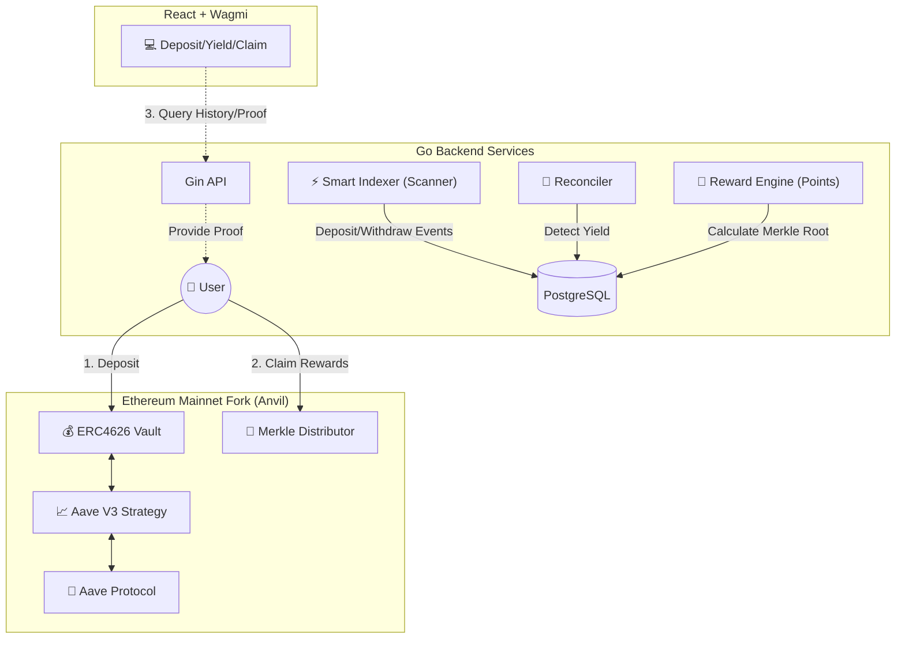

# 🏦 DeFi Staking & Yield Aggregator (Full Stack)


An industrial-grade, full-stack DeFi project demonstration. It  implements an **ERC-4626** standard vault, integrates **Aave V3** for real-world yield generation, and features a high-performance **Go Backend Indexer** (supporting batch sync & reorg protection) along with a **Merkle Tree-based** off-chain points and  airdrop system.

---

## 🏗 Architecture

The system  consists of three layers: **On-Chain Protocol**, **Off-Chain Backend**,  and **User Frontend**.



---

## 🌟 Features

### 1. Smart Contracts (Solidity / Foundry)
* **ERC-4626 Vault**: A standardized tokenized yield vault where users deposit USDT/DAI and receive vTokens.
* **Aave V3 Integration**: Funds are automatically routed via the Strategy to Aave lending pools to generate real interest (aTokens).
* **Merkle Drop**: A highly efficient gas-saving airdrop contract based on Merkle Proofs, supporting massive user bases.

### 2. Backend Services (Go / Gorm / Gin)
* **Smart Indexer**:
    * **Dual-Mode Sync**:  Supports "Batch Sync" (Catch-up mode) for fast history replay and "Live Sync" for real-time monitoring.
    * **Reorg Protection**: Automatically detects chain forks (reorgs) and rolls back dirty data to ensure ledger consistency.
* **Reconciler**: Monitors discrepancies between on-chain balances and database records to automatically detect and record **Yield** events.
* **Reward Engine**: Off-chain calculation of user points based on `Balance * Duration`, generating the Merkle Tree Root for airdrops.

### 3. Frontend Interaction (React / Viem / Wagmi)
* **Real-time Interaction**: Wallet connection, deposits, and withdrawals.
* **Data Visualization**: Charts displaying historical TVL (Total Value Locked).
* **Airdrop Claiming**: Automatically fetches Merkle Proofs from the backend and calls the contract to claim RWD tokens.

---

## 🛠️ Tech Stack

* **Contracts**: Solidity, Foundry (Forge, Anvil, Cast), OpenZeppelin
* **Backend**: Go (Golang), Gorm (ORM), Gin (Web Framework), go-ethereum (RPC Client)
* **Frontend**: React, TypeScript, Vite, Wagmi, Viem, Recharts
* **Database**: PostgreSQL
* **Network**: Ethereum Mainnet Fork (via Alchemy)

---

## 🚀 Quick Start

### Prerequisites
* [Foundry](https://getfoundry.sh/)
* [Go](https://go.dev/) (1.20+)
* [Node.js](https://nodejs.org/) (18+)
* [PostgreSQL](https://www.postgresql.org/)
* **Alchemy API Key** (Required for Mainnet Forking)

### 1. Start Blockchain Environment (Anvil Mainnet Fork)
We need to fork Ethereum Mainnet to interact with the real Aave protocol.
*(Replace `YOUR_ALCHEMY_KEY` with your actual key)*

```bash
# Keep this terminal window running
anvil --fork-url [https://eth-mainnet.g.alchemy.com/v2/YOUR_ALCHEMY_KEY](https://eth-mainnet.g.alchemy.com/v2/YOUR_ALCHEMY_KEY) --chain-id 31337
```

### 2. Deploy Contracts
Open a new terminal to deploy the core contracts.

```bash
# 1. Deploy Vault (Vault + Aave Strategy)
forge script script/DeployAaveVault.s.sol --rpc-url [http://127.0.0.1:8545](http://127.0.0.1:8545) --broadcast

# ⚠️ NOTE: Record the 'Vault deployed at: 0x...' address from the output

# 2. Deploy Reward System (Reward Token + Distributor)
forge script script/DeployReward.s.sol --rpc-url [http://127.0.0.1:8545](http://127.0.0.1:8545) --broadcast

# ⚠️ NOTE: Record the 'Distributor deployed at: 0x...' address from the output
```

### 3. Configure & Start Backend
Update the contract address in `backend/main.go`:
```go
// backend/main.go
var contractAddress = common.HexToAddress("0x...YOUR_VAULT_ADDRESS...")
```
Start the backend server:
```bash
cd backend
# Ensure the database 'defi_db' exists
go run main.go
```

### 4. Configure & Start Frontend
Update the contract addresses in `frontend/src/constants.ts`:
```typescript
export const VAULT_ADDRESS = "0x...YOUR_VAULT_ADDRESS...";
export const DISTRIBUTOR_ADDRESS = "0x...YOUR_DISTRIBUTOR_ADDRESS...";
```
Start the frontend application:
```bash
cd frontend
npm install
npm run dev
```

---

## 🕹️ User Manual

### Flow 1: Deposit & Earn Yield
1.  Open the frontend (usually `http://localhost:5173`).
2.  Connect your wallet (MetaMask) and switch to the Localhost network.
3.  Input an amount (e.g., 100 DAI) and click **Deposit**.
4.  Wait a few seconds; the Go backend will index the transaction, and the chart will update.
5.  Over time, as Aave generates interest, the backend `Reconciler` will automatically record **Yield**, and the TVL will increase.

### Flow 2: Distribute & Claim Rewards (Merkle Drop)
This is a semi-automated process (simulating real-world operations):

1.  **Points Calculation**: The backend `Reward Engine` calculates user points every 10 seconds.
2.  **Get Root**: Visit the API `http://localhost:8080/api/rewards/proof?user=YOUR_WALLET_ADDRESS` and copy the `"root"` field from the JSON response.
3.  **Update Root On-Chain (Admin Action)**:
    Update `script/UpdateRoot.s.sol` with the new Root and Distributor address.
    ```bash
    forge script script/UpdateRoot.s.sol --rpc-url [http://127.0.0.1:8545](http://127.0.0.1:8545) --broadcast
    ```
4.  **Claim Reward**:
    Return to the frontend. The Reward Card will now show the claimable amount. Click **Claim** to receive RWD tokens.

---

## 📂 Project Structure

```
defi-staking/
├── lib/                 # Foundry dependencies
├── src/                 # Solidity contract source code
│   ├── Vault.sol        # ERC4626 Vault
│   ├── AaveStrategy.sol # Aave Strategy Adapter
│   └── MerkleDistributor.sol # Airdrop Contract
├── script/              # Deployment & Interaction scripts
├── backend/             # Go Backend Project
│   ├── main.go          # Main entry (All services)
│   └── utils/           # Merkle Tree implementation
└── frontend/            # React Frontend Project
    ├── src/components/  # UI Components (VaultInfo, RewardCard...)
    └── src/constants.ts # Contract Address Configuration
```

---

## ⚠️ Notes
* This project uses the Alchemy Free Tier. The backend is configured with `BatchSize = 10` to avoid triggering RPC rate limits.
* **Crucial**: Every time you restart Anvil, the chain state resets. You **MUST** redeploy contracts and clear the database tables; otherwise, synchronization errors will occur.

---

**GuangchaoYi**
* Full Stack Developer (Go / Java / Solidity)
* [https://github.com/yiguangchao]
