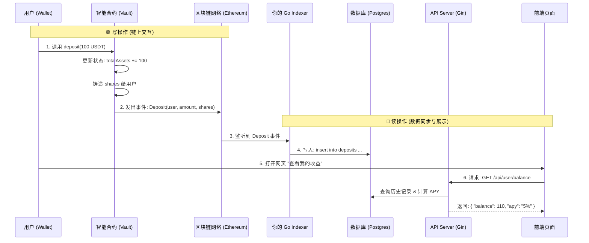
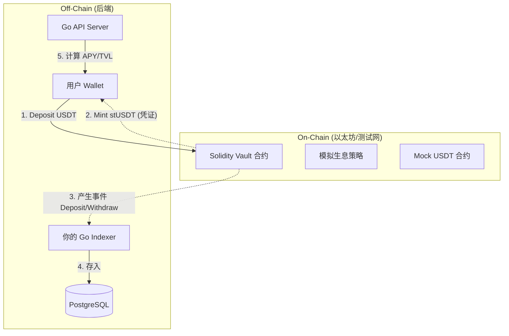
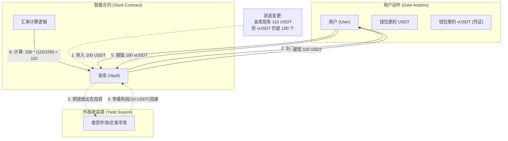

```mermaid
sequenceDiagram
    participant User as 用户 (Wallet)
    participant Contract as 智能合约 (Vault)
    participant Chain as 区块链网络 (Ethereum)
    participant Indexer as 你的 Go Indexer
    participant DB as 数据库 (Postgres)
    participant API as API Server (Gin)
    participant Frontend as 前端页面

    Note over User, Chain: 🟢 写操作 (链上交互)

    User->>Contract: 1. 调用 deposit(100 USDT)
    Contract->>Contract: 更新状态: totalAssets += 100
    Contract->>Contract: 铸造 shares 给用户
    Contract->>Chain: 2. 发出事件: Deposit(user, amount, shares)

    Note over Indexer, Frontend: 🔵 读操作 (数据同步与展示)

    Chain->>Indexer: 3. 监听到 Deposit 事件
    Indexer->>DB: 4. 写入: insert into deposits ...
    
    User->>Frontend: 5. 打开网页 "查看我的收益"
    Frontend->>API: 6. 请求: GET /api/user/balance
    API->>DB: 查询历史记录 & 计算 APY
    API-->>Frontend: 返回: { "balance": 110, "apy": "5%" }
```

```mermaid
graph TD
    User[用户 Wallet] -->|1. Deposit USDT| Vault[Solidity Vault 合约]
    Vault -.->|"2. Mint stUSDT (凭证)"| User
    
    subgraph "On-Chain (以太坊/测试网)"
        Vault
        Strategy[模拟生息策略]
        USDT[Mock USDT 合约]
    end
    
    Vault -.->|3. 产生事件 Deposit/Withdraw| Indexer[你的 Go Indexer]
    
    subgraph "Off-Chain (后端)"
        Indexer -->|4. 存入| DB[(PostgreSQL)]
        API[Go API Server] -->|5. 计算 APY/TVL| User
    end
```

```mermaid
graph TD
    subgraph "用户动作 (User Actions)"
        U["用户 (User)"]
        USDT["钱包里的 USDT"]
        vUSDT["钱包里的 vUSDT (凭证)"]
    end

    subgraph "智能合约 (Vault Contract)"
        Safe["金库 (Vault)"]
        Logic["汇率计算逻辑"]
    end

    subgraph "外部收益源 (Yield Source)"
        Market["借贷市场/交易市场"]
    end

    %% 1. 存款
    U -- "1. 存入 100 USDT" --> Safe
    Safe -- "2. 铸造 100 vUSDT" --> U
    
    %% 3. 生息
    Safe -.->|"3. 把钱借出去投资"| Market
    Market -.->|"4. 带着利润(10 USDT)回来"| Safe
    
    %% 替代 Note 的写法：创建一个信息节点
    InfoNode["状态变更:<br/>金库现有 110 USDT<br/>但 vUSDT 仍是 100 个"] -.-> Safe
    
    %% 5. 取款
    U -- "5. 销毁 100 vUSDT" --> Safe
    Logic -- "6. 计算: 100 * (110/100) = 110" --> Safe
    Safe -- "7. 提现 110 USDT" --> U
```