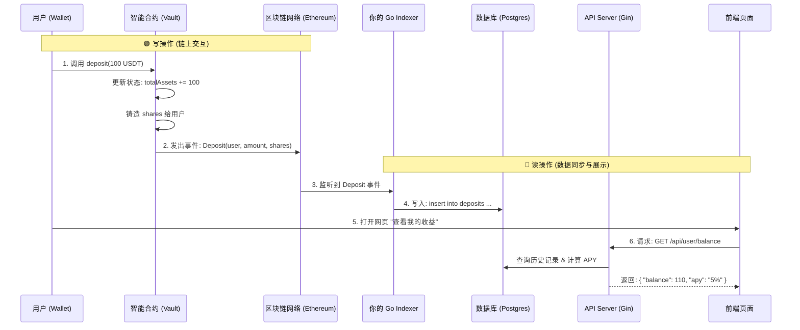

```mermaid
sequenceDiagram
    participant User as 用户 (Wallet)
    participant Contract as 智能合约 (Vault)
    participant Chain as 区块链网络 (Ethereum)
    participant Indexer as 你的 Go Indexer
    participant DB as 数据库 (Postgres)
    participant API as API Server (Gin)
    participant Frontend as 前端页面

    Note over User, Chain: 🟢 写操作 (链上交互)

    User->>Contract: 1. 调用 deposit(100 USDT)
    Contract->>Contract: 更新状态: totalAssets += 100
    Contract->>Contract: 铸造 shares 给用户
    Contract->>Chain: 2. 发出事件: Deposit(user, amount, shares)

    Note over Indexer, Frontend: 🔵 读操作 (数据同步与展示)

    Chain->>Indexer: 3. 监听到 Deposit 事件
    Indexer->>DB: 4. 写入: insert into deposits ...
    
    User->>Frontend: 5. 打开网页 "查看我的收益"
    Frontend->>API: 6. 请求: GET /api/user/balance
    API->>DB: 查询历史记录 & 计算 APY
    API-->>Frontend: 返回: { "balance": 110, "apy": "5%" }
```