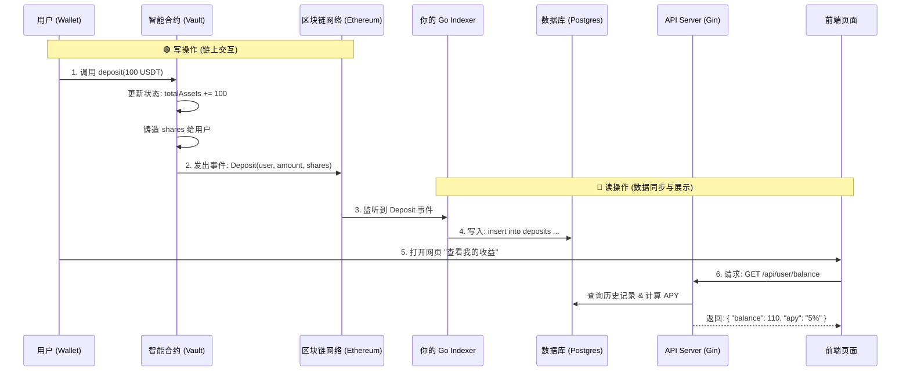
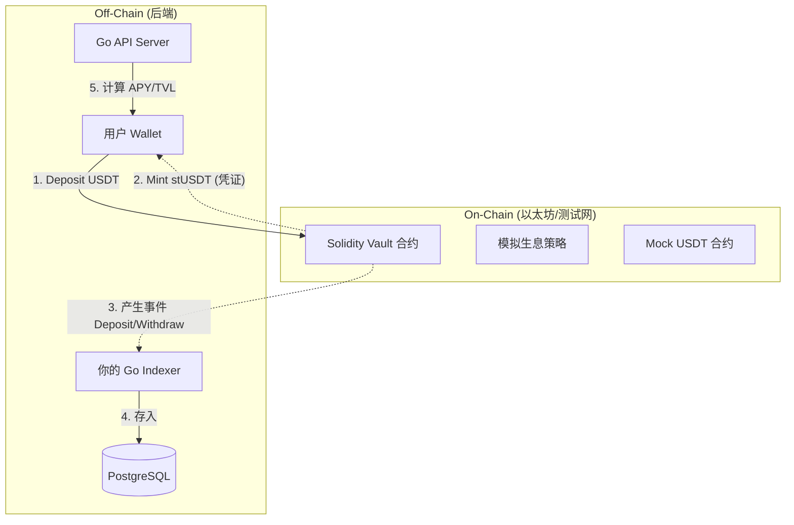
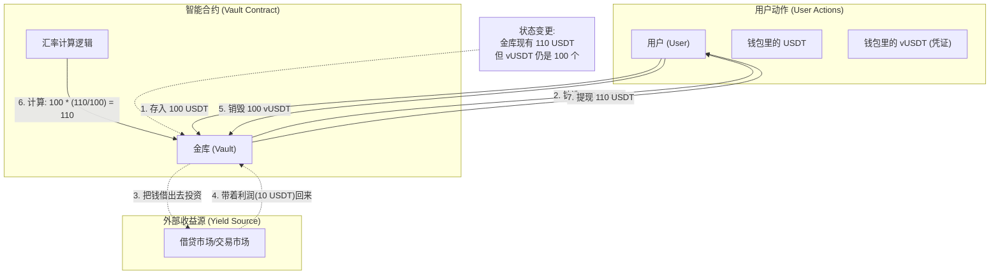
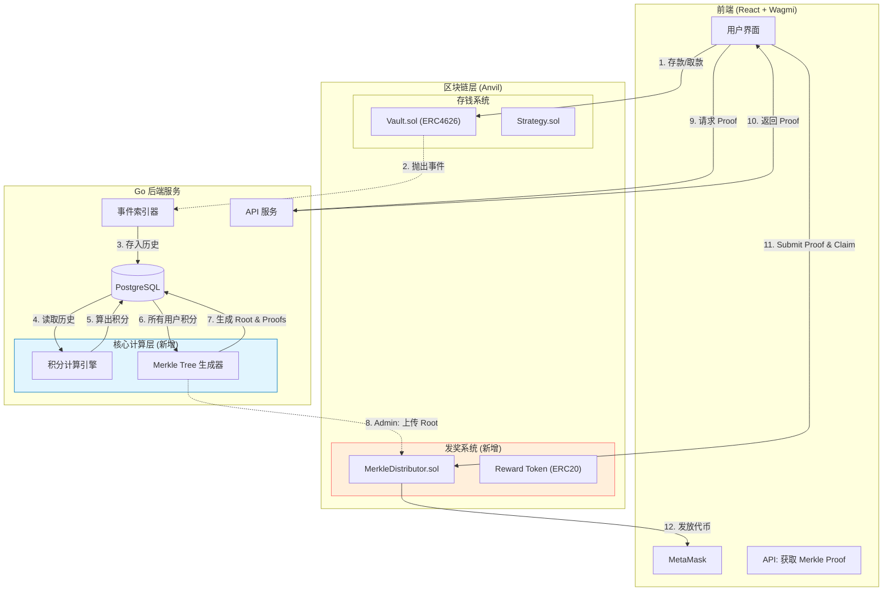

```mermaid
sequenceDiagram
    participant User as 用户 (Wallet)
    participant Contract as 智能合约 (Vault)
    participant Chain as 区块链网络 (Ethereum)
    participant Indexer as 你的 Go Indexer
    participant DB as 数据库 (Postgres)
    participant API as API Server (Gin)
    participant Frontend as 前端页面

    Note over User, Chain: 🟢 写操作 (链上交互)

    User->>Contract: 1. 调用 deposit(100 USDT)
    Contract->>Contract: 更新状态: totalAssets += 100
    Contract->>Contract: 铸造 shares 给用户
    Contract->>Chain: 2. 发出事件: Deposit(user, amount, shares)

    Note over Indexer, Frontend: 🔵 读操作 (数据同步与展示)

    Chain->>Indexer: 3. 监听到 Deposit 事件
    Indexer->>DB: 4. 写入: insert into deposits ...
    

    
    User->>Frontend: 5. 打开网页 "查看我的收益"
    Frontend->>API: 6. 请求: GET /api/user/balance
    API->>DB: 查询历史记录 & 计算 APY
    API-->>Frontend: 返回: { "balance": 110, "apy": "5%" }
```

```mermaid
graph TD
    User[用户 Wallet] -->|1. Deposit USDT| Vault[Solidity Vault 合约]
    Vault -.->|"2. Mint stUSDT (凭证)"| User
    
    subgraph "On-Chain (以太坊/测试网)"
        Vault
        Strategy[模拟生息策略]
        USDT[Mock USDT 合约]
    end
    
    Vault -.->|3. 产生事件 Deposit/Withdraw| Indexer[你的 Go Indexer]
    
    subgraph "Off-Chain (后端)"
        Indexer -->|4. 存入| DB[(PostgreSQL)]
        API[Go API Server] -->|5. 计算 APY/TVL| User
    end
```

```mermaid
graph TD
    subgraph "用户动作 (User Actions)"
        U["用户 (User)"]
        USDT["钱包里的 USDT"]
        vUSDT["钱包里的 vUSDT (凭证)"]
    end

    subgraph "智能合约 (Vault Contract)"
        Safe["金库 (Vault)"]
        Logic["汇率计算逻辑"]
    end

    subgraph "外部收益源 (Yield Source)"
        Market["借贷市场/交易市场"]
    end

    %% 1. 存款
    U -- "1. 存入 100 USDT" --> Safe
    Safe -- "2. 铸造 100 vUSDT" --> U
    
    %% 3. 生息
    Safe -.->|"3. 把钱借出去投资"| Market
    Market -.->|"4. 带着利润(10 USDT)回来"| Safe
    
    %% 替代 Note 的写法：创建一个信息节点
    InfoNode["状态变更:<br/>金库现有 110 USDT<br/>但 vUSDT 仍是 100 个"] -.-> Safe
    
    %% 5. 取款
    U -- "5. 销毁 100 vUSDT" --> Safe
    Logic -- "6. 计算: 100 * (110/100) = 110" --> Safe
    Safe -- "7. 提现 110 USDT" --> U
```
```mermaid
------------------------------------
```

```mermaid
graph TD
    %% 前端层
    subgraph Client ["前端 (React + Wagmi)"]
        UI["用户界面"]
        Wallet["MetaMask"]
        ProofFetcher["API: 获取 Merkle Proof"]
    end

    %% 区块链层
    subgraph Blockchain ["区块链层 (Anvil)"]
        subgraph VaultSystem ["存钱系统"]
            Vault["Vault.sol (ERC4626)"]
            Strategy["Strategy.sol"]
        end
        
        subgraph RewardSystem ["发奖系统 (新增)"]
            Distributor["MerkleDistributor.sol"]
            RewardToken["Reward Token (ERC20)"]
        end
    end

    %% 后端层
    subgraph Backend ["Go 后端服务"]
        Indexer["事件索引器"]
        DB[("PostgreSQL")]
        
        subgraph Computation ["核心计算层 (新增)"]
            RewardEngine["积分计算引擎"]
            MerkleGen["Merkle Tree 生成器"]
        end
        
        API["API 服务"]
    end

    %% --- 交互流 ---
    
    %% 1. 基础存取款
    UI -->|"1. 存款/取款"| Vault
    Vault -.->|"2. 抛出事件"| Indexer
    Indexer -->|"3. 存入历史"| DB
    
    %% 2. 积分计算 (我们刚写的代码)
    DB -->|"4. 读取历史"| RewardEngine
    RewardEngine -->|"5. 算出积分"| DB
    
    %% 3. 生成 Merkle Tree (下一步要做的事)
    DB -->|"6. 所有用户积分"| MerkleGen
    MerkleGen -->|"7. 生成 Root & Proofs"| DB
    
    %% 4. 管理员上链 (关键闭环)
    MerkleGen -.->|"8. Admin: 上传 Root"| Distributor
    
    %% 5. 用户领奖
    UI -->|"9. 请求 Proof"| API
    API -->|"10. 返回 Proof"| UI
    UI -->|"11. Submit Proof & Claim"| Distributor
    Distributor -->|"12. 发放代币"| Wallet
    
    %% 样式美化
    style RewardSystem fill:#ffefdb,stroke:#f66
    style Computation fill:#e1f5fe,stroke:#0277bd
```