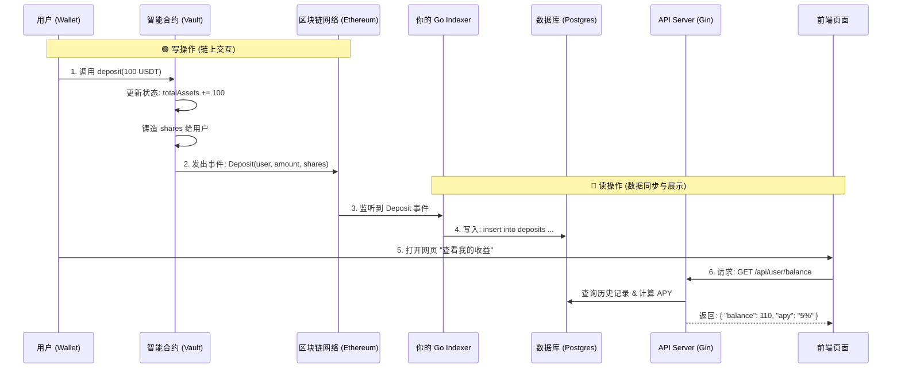
```mermaid
sequenceDiagram
    participant User as 用户 (Wallet)
    participant Contract as 智能合约 (Vault)
    participant Chain as 区块链网络 (Ethereum)
    participant Indexer as 你的 Go Indexer
    participant DB as 数据库 (Postgres)
    participant API as API Server (Gin)
    participant Frontend as 前端页面

    Note over User, Chain: 🟢 写操作 (链上交互)

    User->>Contract: 1. 调用 deposit(100 USDT)
    Contract->>Contract: 更新状态: totalAssets += 100
    Contract->>Contract: 铸造 shares 给用户
    Contract->>Chain: 2. 发出事件: Deposit(user, amount, shares)

    Note over Indexer, Frontend: 🔵 读操作 (数据同步与展示)

    Chain->>Indexer: 3. 监听到 Deposit 事件
    Indexer->>DB: 4. 写入: insert into deposits ...
    

    
    User->>Frontend: 5. 打开网页 "查看我的收益"
    Frontend->>API: 6. 请求: GET /api/user/balance
    API->>DB: 查询历史记录 & 计算 APY
    API-->>Frontend: 返回: { "balance": 110, "apy": "5%" }
```

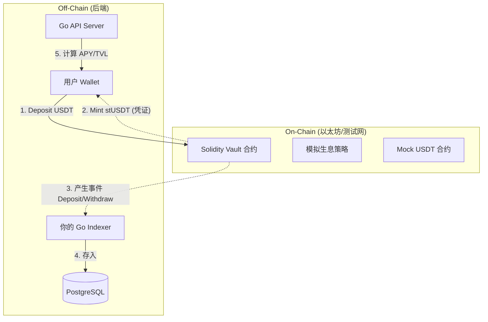
```mermaid
graph TD
    User[用户 Wallet] -->|1. Deposit USDT| Vault[Solidity Vault 合约]
    Vault -.->|"2. Mint stUSDT (凭证)"| User
    
    subgraph "On-Chain (以太坊/测试网)"
        Vault
        Strategy[模拟生息策略]
        USDT[Mock USDT 合约]
    end
    
    Vault -.->|3. 产生事件 Deposit/Withdraw| Indexer[你的 Go Indexer]
    
    subgraph "Off-Chain (后端)"
        Indexer -->|4. 存入| DB[(PostgreSQL)]
        API[Go API Server] -->|5. 计算 APY/TVL| User
    end
```

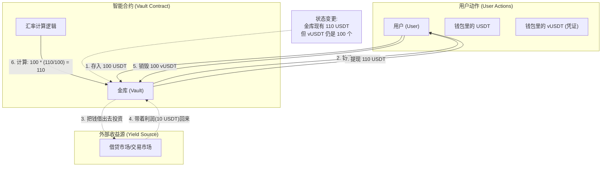
```mermaid
graph TD
    subgraph "用户动作 (User Actions)"
        U["用户 (User)"]
        USDT["钱包里的 USDT"]
        vUSDT["钱包里的 vUSDT (凭证)"]
    end

    subgraph "智能合约 (Vault Contract)"
        Safe["金库 (Vault)"]
        Logic["汇率计算逻辑"]
    end

    subgraph "外部收益源 (Yield Source)"
        Market["借贷市场/交易市场"]
    end

    %% 1. 存款
    U -- "1. 存入 100 USDT" --> Safe
    Safe -- "2. 铸造 100 vUSDT" --> U
    
    %% 3. 生息
    Safe -.->|"3. 把钱借出去投资"| Market
    Market -.->|"4. 带着利润(10 USDT)回来"| Safe
    
    %% 替代 Note 的写法：创建一个信息节点
    InfoNode["状态变更:<br/>金库现有 110 USDT<br/>但 vUSDT 仍是 100 个"] -.-> Safe
    
    %% 5. 取款
    U -- "5. 销毁 100 vUSDT" --> Safe
    Logic -- "6. 计算: 100 * (110/100) = 110" --> Safe
    Safe -- "7. 提现 110 USDT" --> U
```
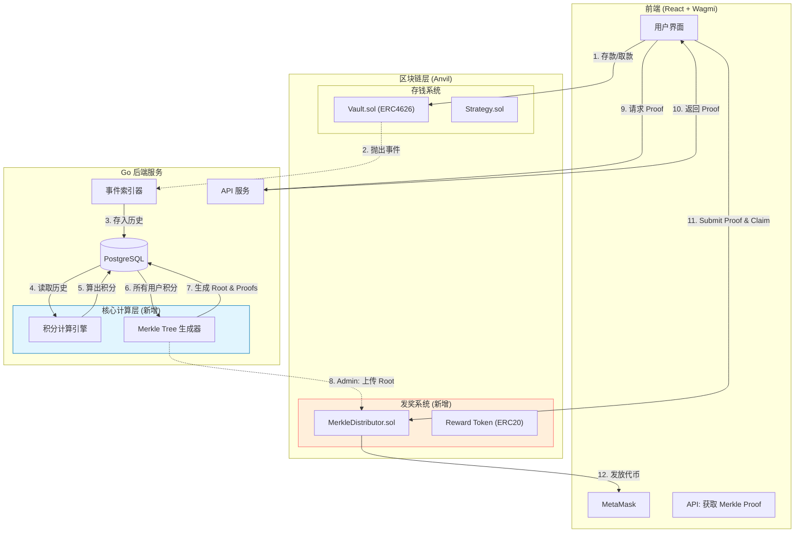
```mermaid
graph TD
    %% 前端层
    subgraph Client ["前端 (React + Wagmi)"]
        UI["用户界面"]
        Wallet["MetaMask"]
        ProofFetcher["API: 获取 Merkle Proof"]
    end

    %% 区块链层
    subgraph Blockchain ["区块链层 (Anvil)"]
        subgraph VaultSystem ["存钱系统"]
            Vault["Vault.sol (ERC4626)"]
            Strategy["Strategy.sol"]
        end
        
        subgraph RewardSystem ["发奖系统 (新增)"]
            Distributor["MerkleDistributor.sol"]
            RewardToken["Reward Token (ERC20)"]
        end
    end

    %% 后端层
    subgraph Backend ["Go 后端服务"]
        Indexer["事件索引器"]
        DB[("PostgreSQL")]
        
        subgraph Computation ["核心计算层 (新增)"]
            RewardEngine["积分计算引擎"]
            MerkleGen["Merkle Tree 生成器"]
        end
        
        API["API 服务"]
    end

    %% --- 交互流 ---
    
    %% 1. 基础存取款
    UI -->|"1. 存款/取款"| Vault
    Vault -.->|"2. 抛出事件"| Indexer
    Indexer -->|"3. 存入历史"| DB
    
    %% 2. 积分计算 (我们刚写的代码)
    DB -->|"4. 读取历史"| RewardEngine
    RewardEngine -->|"5. 算出积分"| DB
    
    %% 3. 生成 Merkle Tree (下一步要做的事)
    DB -->|"6. 所有用户积分"| MerkleGen
    MerkleGen -->|"7. 生成 Root & Proofs"| DB
    
    %% 4. 管理员上链 (关键闭环)
    MerkleGen -.->|"8. Admin: 上传 Root"| Distributor
    
    %% 5. 用户领奖
    UI -->|"9. 请求 Proof"| API
    API -->|"10. 返回 Proof"| UI
    UI -->|"11. Submit Proof & Claim"| Distributor
    Distributor -->|"12. 发放代币"| Wallet
    
    %% 样式美化
    style RewardSystem fill:#ffefdb,stroke:#f66
    style Computation fill:#e1f5fe,stroke:#0277bd
```
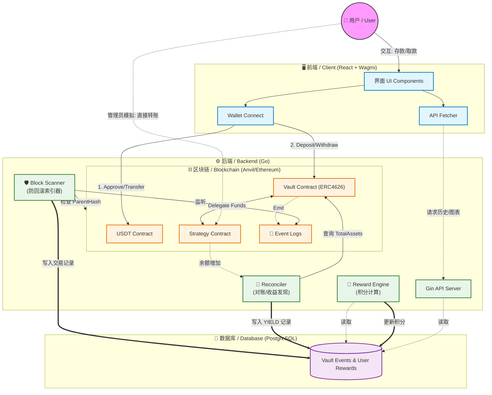
```mermaid
graph TD
    %% 定义样式
    classDef user fill:#f9f,stroke:#333,stroke-width:2px;
    classDef front fill:#e1f5fe,stroke:#0277bd,stroke-width:2px;
    classDef chain fill:#fff3e0,stroke:#ef6c00,stroke-width:2px;
    classDef back fill:#e8f5e9,stroke:#2e7d32,stroke-width:2px;
    classDef db fill:#f3e5f5,stroke:#7b1fa2,stroke-width:2px;

    User(("🤵 用户 / User")):::user

    %% 前端层
    subgraph Client ["🖥️ 前端 / Client (React + Wagmi)"]
        UI["界面 UI Components"]:::front
        Wallet["Wallet Connect"]:::front
        API_Caller["API Fetcher"]:::front
        
        UI --> Wallet
        UI --> API_Caller
    end

    User -->|"交互: 存款/取款"| UI

    %% 区块链层
    subgraph Blockchain ["⛓️ 区块链 / Blockchain (Anvil/Ethereum)"]
        Token["USDT Contract"]:::chain
        Vault["Vault Contract (ERC4626)"]:::chain
        Strategy["Strategy Contract"]:::chain
        Events["📜 Event Logs"]:::chain

        Wallet -->|"1. Approve/Transfer"| Token
        Wallet -->|"2. Deposit/Withdraw"| Vault
        Vault <-->|"Delegate Funds"| Strategy
        Vault -.->|"Emit"| Events
    end

    %% 后端层
    subgraph Backend ["⚙️ 后端 / Backend (Go)"]
        API_Server["Gin API Server"]:::back
        Scanner["🛡️ Block Scanner<br/>(防回滚索引器)"]:::back
        Reconciler["🤖 Reconciler<br/>(对账/收益发现)"]:::back
        RewardEngine["🧮 Reward Engine<br/>(积分计算)"]:::back

        Scanner -->|"监听"| Events
        Scanner -->|"检查 ParentHash"| Blockchain
        Reconciler -->|"查询 TotalAssets"| Vault
    end

    %% 数据库层
    subgraph Database ["💾 数据库 / Database (PostgreSQL)"]
        DB[("Vault Events & User Rewards")]:::db
    end

    %% 数据流向
    Scanner == "写入交易记录" ==> DB
    Reconciler == "写入 YIELD 记录" ==> DB
    RewardEngine -.->|"读取"| DB
    RewardEngine == "更新积分" ==> DB
    
    API_Caller -.->|"请求历史/图表"| API_Server
    API_Server -.->|"读取"| DB

    %% 隐性收益逻辑
    User -.->|"管理员模拟: 直接转账"| Strategy
    Strategy -.->|"余额增加"| Reconciler
```
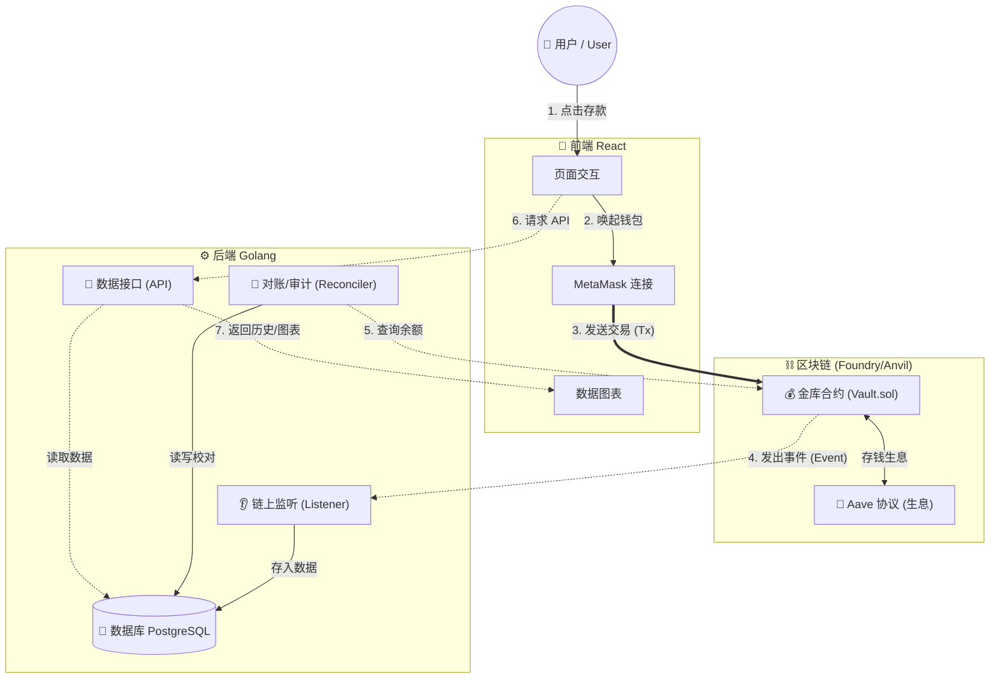
```mermaid
graph TD
    %% 角色定义
    User((🤵 用户 / User))
    
    %% 1. 前端层 (React)
    subgraph Frontend [📱 前端 React]
        UI[页面交互]
        Wallet[MetaMask 连接]
        Chart[数据图表]
    end

    %% 2. 区块链层 (Solidity)
    subgraph Blockchain ["⛓️ 区块链 (Foundry/Anvil)"]
        Vault["💰 金库合约 (Vault.sol)"]
        Aave["🏦 Aave 协议 (生息)"]
        
        Vault <-->|存钱生息| Aave
    end

    %% 3. 后端层 (Golang)
    subgraph Backend [⚙️ 后端 Golang]
        Listener["👂 链上监听 (Listener)"]
        Reconciler["🤖 对账/审计 (Reconciler)"]
        API["🚀 数据接口 (API)"]
        DB[(💾 数据库 PostgreSQL)]
        
        Listener -->|存入数据| DB
        Reconciler -->|读写校对| DB
        API -.->|读取数据| DB
    end

    %% 交互连线
    %% A. 资金流 (写操作) - 不经过后端
    User -->|1. 点击存款| UI
    UI -->|2. 唤起钱包| Wallet
    Wallet == 3. 发送交易 (Tx) ==> Vault

    %% B. 数据流 (读操作) - 经过后端
    Vault -.->|"4. 发出事件 (Event)"| Listener
    Reconciler -.->|5. 查询余额| Vault
    UI -.->|6. 请求 API| API
    API -.->|7. 返回历史/图表| Chart
```
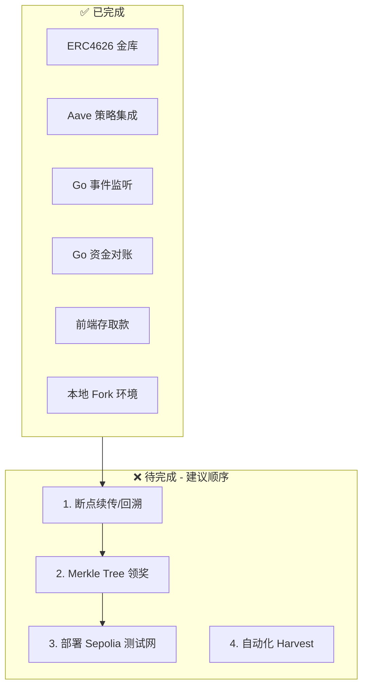
```mermaid
graph TD
    subgraph Done [✅ 已完成]
        Vault[ERC4626 金库]
        Aave[Aave 策略集成]
        GoScan[Go 事件监听]
        GoRec[Go 资金对账]
        React[前端存取款]
        Local[本地 Fork 环境]
    end

    subgraph ToDo [❌ 待完成 - 建议顺序]
        Backfill[1. 断点续传/回溯]
        Merkle[2. Merkle Tree 领奖]
        Testnet[3. 部署 Sepolia 测试网]
        Keeper[4. 自动化 Harvest]
    end

    Done --> Backfill
    Backfill --> Merkle
    Merkle --> Testnet
```
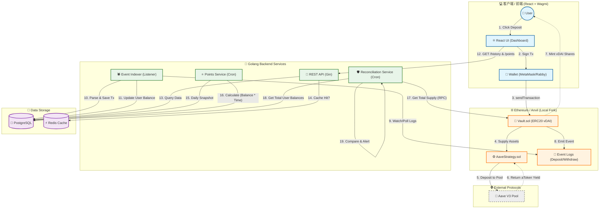
```mermaid
graph TD
    %% 定义样式
    classDef frontend fill:#e1f5fe,stroke:#01579b,stroke-width:2px;
    classDef contract fill:#fff3e0,stroke:#ff6f00,stroke-width:2px;
    classDef backend fill:#e8f5e9,stroke:#2e7d32,stroke-width:2px;
    classDef storage fill:#f3e5f5,stroke:#7b1fa2,stroke-width:2px;
    classDef external fill:#eeeeee,stroke:#616161,stroke-width:2px,stroke-dasharray: 5 5;

    %% --- 1. 用户前端层 (Frontend Layer) ---
    subgraph Client_Side ["💻 客户端 / 前端 (React + Wagmi)"]
        User((👤 User))
        Wallet["🦊 Wallet (MetaMask/Rabby)"]
        UI["⚛️ React UI (Dashboard)"]
    end

    %% --- 2. 链上合约层 (On-Chain Layer) ---
    subgraph Blockchain ["⛓️ Ethereum / Anvil (Local Fork)"]
        Vault["🏦 Vault.sol (ERC20 vDAI)"]
        Strategy[⚙️ AaveStrategy.sol]
        Logs["📜 Event Logs (Deposit/Withdraw)"]
    end

    %% --- 3. 外部协议 (External Protocol) ---
    subgraph External_DeFi [🌐 External Protocols]
        AaveV3[👻 Aave V3 Pool]
    end

    %% --- 4. 后端服务层 (Backend Layer) ---
    subgraph Backend_Services [🚀 Golang Backend Services]
        Indexer["️🕷 Event Indexer (Listener)"]
        API["🔌 REST API (Gin)"]
        PointsSvc["⭐ Points Service (Cron)"]
        ReconSvc["🛡️ Reconciliation Service (Cron)"]
    end

    %% --- 5. 数据存储层 (Data Layer) ---
    subgraph Storage [💾 Data Storage]
        DB[(🐘 PostgreSQL)]
        Redis[(⚡ Redis Cache)]
    end

    %% ================= 连线关系 (Flows) =================

    %% Flow A: 用户存款流程 (Deposit Flow)
    User -->|1. Click Deposit| UI
    UI -->|2. Sign Tx| Wallet
    Wallet -->|3. sendTransaction| Vault
    Vault -->|4. Supply Assets| Strategy
    Strategy -->|5. Deposit to Pool| AaveV3
    AaveV3 -.->|6. Return aToken Yield| Strategy
    Vault -.->|7. Mint vDAI Shares| User
    Vault -- 8. Emit Event --> Logs

    %% Flow B: 数据索引流程 (Indexing Flow)
    Indexer -- 9. Watch/Poll Logs --> Logs
    Indexer -->|10. Parse & Save Tx| DB
    Indexer -->|11. Update User Balance| DB

    %% Flow C: 数据查询流程 (Read Flow)
    UI -- 12. GET /history & /points --> API
    API -- 13. Query Data --> DB
    API -- 14. Cache Hit? --> Redis

    %% Flow D: 积分计算流程 (Points System)
    PointsSvc -- 15. Daily Snapshot --> DB
    PointsSvc -->|"16. Calculate (Balance * Time)"| DB

    %% Flow E: 对账风控流程 (Reconciliation)
    ReconSvc -- 17. Get Total Supply (RPC) --> Vault
    ReconSvc -- 18. Get Total User Balances --> DB
    ReconSvc -->|19. Compare & Alert| ReconSvc

    %% 应用样式
    class User,Wallet,UI frontend;
    class Vault,Strategy,Logs contract;
    class Indexer,API,PointsSvc,ReconSvc backend;
    class DB,Redis storage;
    class AaveV3 external;
```

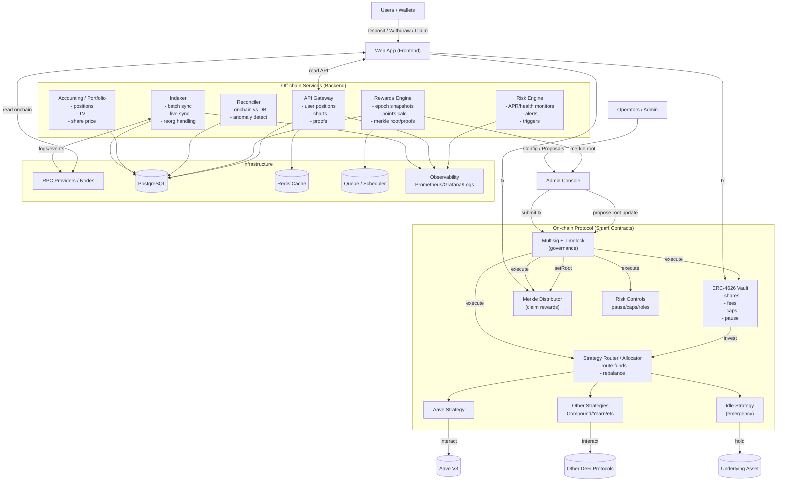
```mermaid
flowchart TB
  %% ========== Users & UI ==========
  U[Users / Wallets] -->|Deposit / Withdraw / Claim| FE["Web App (Frontend)"]
  OP[Operators / Admin] -->|Config / Proposals| ADMIN[Admin Console]

  %% ========== On-chain ==========
  subgraph ON["On-chain Protocol (Smart Contracts)"]
    VAULT["ERC-4626 Vault\n- shares\n- fees\n- caps\n- pause"]
    ROUTER["Strategy Router / Allocator\n- route funds\n- rebalance"]
    STRAT1[Aave Strategy]
    STRAT2["Other Strategies\nCompound/Yearn/etc"]
    IDLE["Idle Strategy\n(emergency)"]
    DIST["Merkle Distributor\n(claim rewards)"]
    GOV["Multisig + Timelock\n(governance)"]
    RISK["Risk Controls\npause/caps/roles"]
  end

  %% Frontend calls on-chain
  FE -->|tx| VAULT
  FE -->|tx| DIST
  ADMIN -->|submit tx| GOV
  GOV -->|execute| RISK
  GOV -->|execute| VAULT
  GOV -->|execute| ROUTER
  GOV -->|execute| DIST

  %% Vault routes to strategies
  VAULT -->|invest| ROUTER
  ROUTER --> STRAT1
  ROUTER --> STRAT2
  ROUTER --> IDLE
  STRAT1 -->|interact| AAVE[(Aave V3)]
  STRAT2 -->|interact| EXT[(Other DeFi Protocols)]
  IDLE -->|hold| ASSET[(Underlying Asset)]

  %% ========== Off-chain ==========
  subgraph OFF["Off-chain Services (Backend)"]
    IDX["Indexer\n- batch sync\n- live sync\n- reorg handling"]
    ACC["Accounting / Portfolio\n- positions\n- TVL\n- share price"]
    REC["Reconciler\n- onchain vs DB\n- anomaly detect"]
    REW["Rewards Engine\n- epoch snapshots\n- points calc\n- merkle root/proofs"]
    RENG["Risk Engine\n- APR/health monitors\n- alerts\n- triggers"]
    API["API Gateway\n- user positions\n- charts\n- proofs"]
  end

  %% Infra
  subgraph INFRA[Infrastructure]
    RPC[RPC Providers / Nodes]
    DB[(PostgreSQL)]
    CACHE[(Redis Cache)]
    QUEUE[(Queue / Scheduler)]
    OBS["Observability\nPrometheus/Grafana/Logs"]
  end

  %% Connections
  IDX <-->|logs/events| RPC
  IDX --> DB
  ACC --> DB
  REC --> DB
  REW --> DB
  API --> DB
  API --> CACHE
  REW --> QUEUE
  IDX --> OBS
  API --> OBS
  RENG --> OBS

  %% Reward root update
  REW -->|merkle root| ADMIN
  ADMIN -->|propose root update| GOV
  GOV -->|setRoot| DIST

  %% Frontend reads
  FE <-->|read API| API
  FE <-->|read onchain| RPC
```

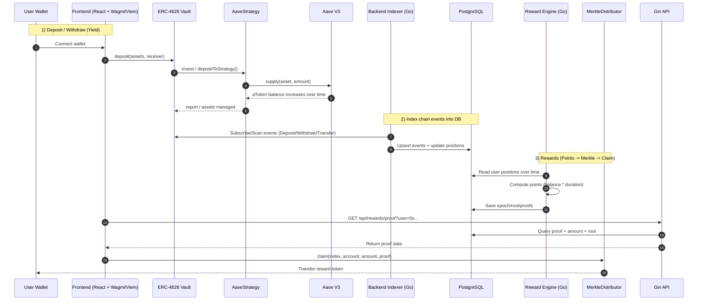
```mermaid
sequenceDiagram
  autonumber
  participant User as User Wallet
  participant FE as Frontend (React + Wagmi/Viem)
  participant Vault as ERC-4626 Vault
  participant Strat as AaveStrategy
  participant Aave as Aave V3
  participant IDX as Backend Indexer (Go)
  participant DB as PostgreSQL
  participant REW as Reward Engine (Go)
  participant Dist as MerkleDistributor
  participant API as Gin API

  Note over User,FE: 1) Deposit / Withdraw (Yield)
  User->>FE: Connect wallet
  FE->>Vault: deposit(assets, receiver)
  Vault->>Strat: invest / depositToStrategy()
  Strat->>Aave: supply(asset, amount)
  Aave-->>Strat: aToken balance increases over time
  Strat-->>Vault: report / assets managed

  Note over IDX,DB: 2) Index chain events into DB
  IDX->>Vault: Subscribe/Scan events (Deposit/Withdraw/Transfer)
  IDX->>DB: Upsert events + update positions

  Note over REW,Dist: 3) Rewards (Points -> Merkle -> Claim)
  REW->>DB: Read user positions over time
  REW->>REW: Compute points (balance * duration)
  REW->>DB: Save epoch/root/proofs
  FE->>API: GET /api/rewards/proof?user=0x...
  API->>DB: Query proof + amount + root
  API-->>FE: Return proof data
  FE->>Dist: claim(index, account, amount, proof)
  Dist-->>User: Transfer reward token

```

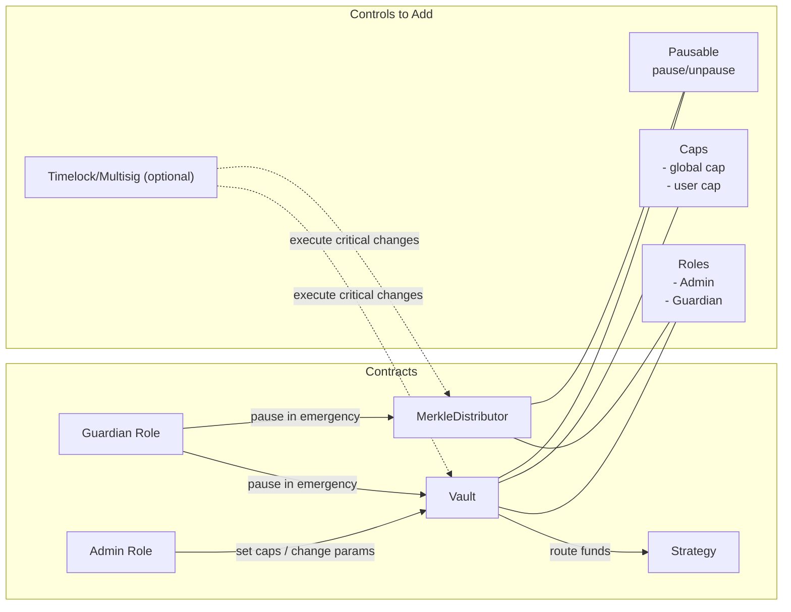
```mermaid
flowchart LR
  subgraph Contracts[Contracts]
    V[Vault]
    S[Strategy]
    D[MerkleDistributor]
    G[Guardian Role]
    A[Admin Role]
  end

  subgraph Controls[Controls to Add]
    P[Pausable\npause/unpause]
    C[Caps\n- global cap\n- user cap]
    R[Roles\n- Admin\n- Guardian]
    T["Timelock/Multisig (optional)"]
  end

  A -->|set caps / change params| V
  G -->|pause in emergency| V
  G -->|pause in emergency| D
  V -->|route funds| S

  V --- P
  V --- C
  V --- R
  D --- P
  D --- R
  T -.->|execute critical changes| V
  T -.->|execute critical changes| D
```
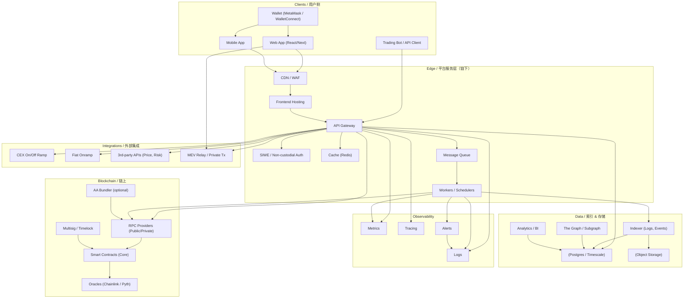
```mermaid
flowchart TB
  %% ====== Clients ======
  subgraph Clients[Clients / 用户侧]
    Web["Web App (React/Next)"]
    Mobile[Mobile App]
    Bot[Trading Bot / API Client]
    Wallet["Wallet (MetaMask / WalletConnect)"]
  end

  %% ====== Edge & Services ======
  subgraph Edge["Edge / 平台服务层（链下）"]
    CDN[CDN / WAF]
    FE[Frontend Hosting]
    API[API Gateway]
    Auth[SIWE / Non-custodial Auth]
    Cache["Cache (Redis)"]
    MQ[Message Queue]
    Worker[Workers / Schedulers]
  end

  %% ====== Data & Observability ======
  subgraph Data[Data / 索引 & 存储]
    Indexer["Indexer (Logs, Events)"]
    Subgraph[The Graph / Subgraph]
    DB["(Postgres / Timescale)"]
    TS["(Object Storage)"]
    Analytics[Analytics / BI]
  end

  subgraph Obs[Observability]
    Logs[Logs]
    Metrics[Metrics]
    Traces[Tracing]
    Alerts[Alerts]
  end

  %% ====== Chain ======
  subgraph Chain[Blockchain / 链上]
    RPC["RPC Providers (Public/Private)"]
    Bundler["AA Bundler (optional)"]
    Oracle["Oracles (Chainlink / Pyth)"]
    Contracts["Smart Contracts (Core)"]
    Multisig[Multisig / Timelock]
  end

  %% ====== Integrations ======
  subgraph Integrations[Integrations / 外部集成]
    CEX[CEX On/Off Ramp]
    Fiat[Fiat Onramp]
    Third["3rd-party APIs (Price, Risk)"]
    MEV[MEV Relay / Private Tx]
  end

  %% ====== Flows ======
  Web --> CDN --> FE
  Mobile --> CDN
  Bot --> API

  Wallet --> Web
  Wallet --> Mobile

  FE --> API
  API --> Auth
  API --> Cache
  API --> DB
  API --> MQ
  MQ --> Worker

  Worker --> Indexer
  Indexer --> DB
  Indexer --> TS
  Subgraph --> DB
  Analytics --> DB

  API --> RPC
  Worker --> RPC
  RPC --> Contracts
  Contracts --> Oracle
  Multisig --> Contracts

  API --> Third
  API --> Fiat
  API --> CEX
  Web --> MEV
  API --> MEV
  Bundler --> RPC

  API --> Logs
  API --> Metrics
  API --> Traces
  Worker --> Logs
  Worker --> Metrics
  Worker --> Alerts
  Alerts --> Logs
```
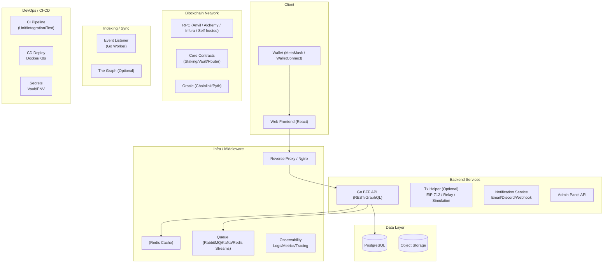
```mermaid
flowchart TB
  %% ============ Client ============
  subgraph C[Client]
    FE["Web Frontend (React)"]
    WAL["Wallet (MetaMask / WalletConnect)"]
  end

  %% ============ Backend ============
  subgraph S[Backend Services]
    BFF["Go BFF API (REST/GraphQL)"]
    Signer["Tx Helper (Optional)\nEIP-712 / Relay / Simulation"]
    Notif[Notification Service\nEmail/Discord/Webhook]
    Admin[Admin Panel API]
  end

  %% ============ Infra ============
  subgraph I[Infra / Middleware]
    NGINX[Reverse Proxy / Nginx]
    REDIS["(Redis Cache)"]
    MQ["Queue (RabbitMQ/Kafka/Redis Streams)"]
    OBS[Observability\nLogs/Metrics/Tracing]
  end

  %% ============ Data ============
  subgraph D[Data Layer]
    PG[(PostgreSQL)]
    OBJ[(Object Storage)]
  end

  %% ============ Chain ============
  subgraph CH[Blockchain Network]
    RPC["RPC (Anvil / Alchemy / Infura / Self-hosted)"]
    Core["Core Contracts\n(Staking/Vault/Router)"]
    Oracle["Oracle (Chainlink/Pyth)"]
  end

  %% ============ Indexing ============
  subgraph X[Indexing / Sync]
    Listener["Event Listener\n(Go Worker)"]
    Subgraph["The Graph (Optional)"]
  end

  %% ============ DevOps ============
  subgraph O[DevOps / CI-CD]
    CI["CI Pipeline\n(Unit/Integration/Test)"]
    CD[CD Deploy\nDocker/K8s]
    Secret[Secrets\nVault/ENV]
  end

  %% ----------- Flows -----------
  FE --> NGINX --> BFF
  WAL --> FE

  BFF --> REDIS
  BFF --> PG
  BFF --> MQ
```
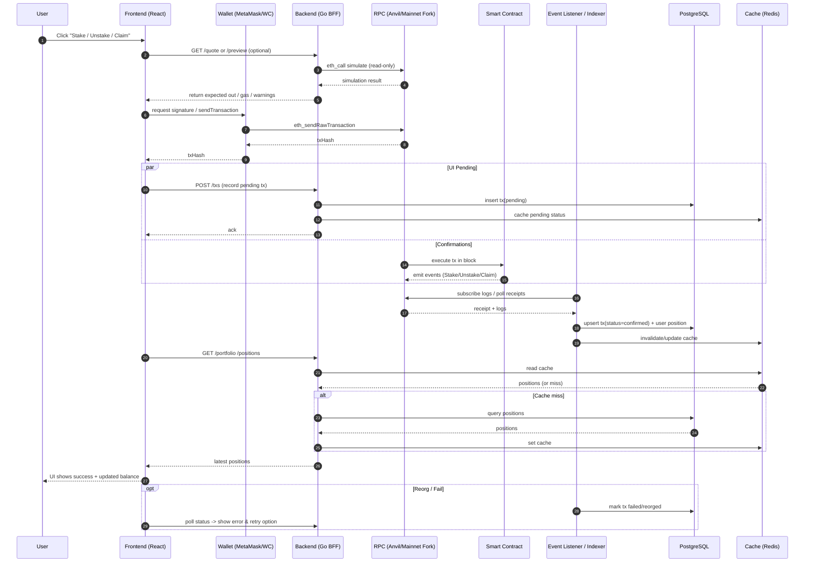
```mermaid
sequenceDiagram
  autonumber
  participant U as User
  participant FE as Frontend (React)
  participant W as Wallet (MetaMask/WC)
  participant B as Backend (Go BFF)
  participant RPC as RPC (Anvil/Mainnet Fork)
  participant SC as Smart Contract
  participant IDX as Event Listener / Indexer
  participant DB as PostgreSQL
  participant C as Cache (Redis)

  U->>FE: Click "Stake / Unstake / Claim"
  FE->>B: GET /quote or /preview (optional)
  B->>RPC: eth_call simulate (read-only)
  RPC-->>B: simulation result
  B-->>FE: return expected out / gas / warnings

  FE->>W: request signature / sendTransaction
  W->>RPC: eth_sendRawTransaction
  RPC-->>W: txHash
  W-->>FE: txHash

  par UI Pending
    FE->>B: POST /txs (record pending tx)
    B->>DB: insert tx(pending)
    B->>C: cache pending status
    B-->>FE: ack
  and Confirmations
    RPC->>SC: execute tx in block
    SC-->>RPC: emit events (Stake/Unstake/Claim)
  end

  IDX->>RPC: subscribe logs / poll receipts
  RPC-->>IDX: receipt + logs
  IDX->>DB: upsert tx(status=confirmed) + user position
  IDX->>C: invalidate/update cache

  FE->>B: GET /portfolio /positions
  B->>C: read cache
  C-->>B: positions (or miss)
  alt Cache miss
    B->>DB: query positions
    DB-->>B: positions
    B->>C: set cache
  end
  B-->>FE: latest positions
  FE-->>U: UI shows success + updated balance

  opt Reorg / Fail
    IDX->>DB: mark tx failed/reorged
    FE->>B: poll status -> show error & retry option
  end
```
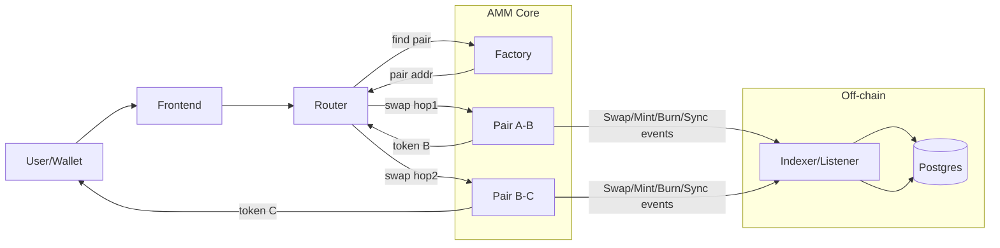
```mermaid
flowchart LR
  U[User/Wallet] --> FE[Frontend]
  FE --> R[Router]

  subgraph AMM[AMM Core]
    F[Factory]
    P1[Pair A-B]
    P2[Pair B-C]
  end

  R -->|find pair| F
  F -->|pair addr| R

  R -->|swap hop1| P1
  P1 -->|token B| R
  R -->|swap hop2| P2
  P2 -->|token C| U

  subgraph Indexing[Off-chain]
    IDX[Indexer/Listener]
    DB[(Postgres)]
  end

  P1 -->|Swap/Mint/Burn/Sync events| IDX --> DB
  P2 -->|Swap/Mint/Burn/Sync events| IDX --> DB
```
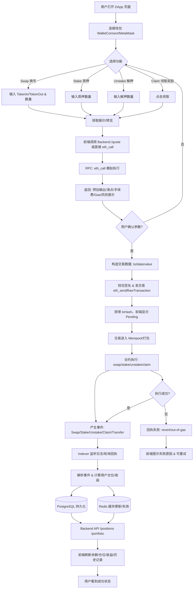
```mermaid
flowchart TD
  A[用户打开 DApp 页面] --> B[连接钱包 WalletConnect/MetaMask]
  B --> C{选择功能}
  C -->|Swap 换币| S1[输入 TokenIn/TokenOut & 数量]
  C -->|Stake 质押| T1[输入质押数量]
  C -->|Unstake 解押| T2[输入解押数量]
  C -->|Claim 领取奖励| T3[点击领取]

  %% ---- Quote / Preview ----
  S1 --> Q[获取报价/预览]
  T1 --> Q
  T2 --> Q
  T3 --> Q

  Q --> Q1[前端调用 Backend /quote 或直接 eth_call]
  Q1 --> Q2[RPC: eth_call 模拟执行]
  Q2 --> Q3[返回: 预估输出/滑点/手续费/Gas/风险提示]
  Q3 --> D{用户确认参数?}

  %% ---- Tx Build & Sign ----
  D -->|否| C
  D -->|是| E[构造交易数据: to/data/value]
  E --> F[钱包签名 & 发交易 eth_sendRawTransaction]
  F --> G[获得 txHash，前端显示 Pending]

  %% ---- On-chain Execution ----
  G --> H[交易进入 Mempool/打包]
  H --> I[合约执行: swap/stake/unstake/claim]
  I --> J[产生事件: Swap/Stake/Unstake/Claim/Transfer]

  %% ---- Off-chain Indexing ----
  J --> K[Indexer 监听日志/轮询回执]
  K --> L[解析事件 & 计算用户仓位/收益]
  L --> M[(PostgreSQL 持久化)]
  L --> N[(Redis 缓存更新/失效)]

  %% ---- UI Refresh ----
  M --> O[Backend API /positions /portfolio]
  N --> O
  O --> P[前端刷新余额/仓位/收益/历史记录]
  P --> Z[用户看到成功状态]

  %% ---- Exceptions ----
  I --> X{执行成功?}
  X -->|否| X1[回执失败: revert/out-of-gas]
  X1 --> X2[前端提示失败原因 & 可重试]
  X -->|是| J
```
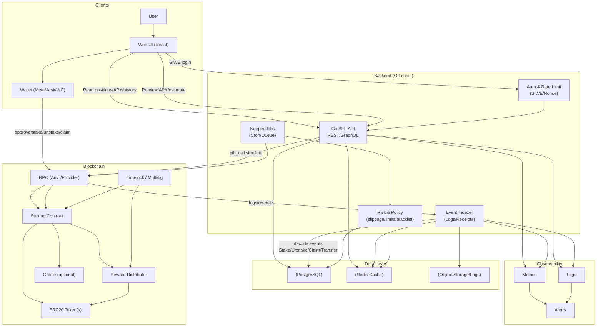
```mermaid
flowchart TB
  %% ========= Clients =========
  subgraph C[Clients]
    U[User]
    FE["Web UI (React)"]
    WAL["Wallet (MetaMask/WC)"]
  end

  %% ========= Backend =========
  subgraph B["Backend (Off-chain)"]
    API[Go BFF API\nREST/GraphQL]
    IDX["Event Indexer\n(Logs/Receipts)"]
    JOB["Keeper/Jobs\n(Cron/Queue)"]
    RISK["Risk & Policy\n(slippage/limits/blacklist)"]
    AUTH["Auth & Rate Limit\n(SIWE/Nonce)"]
  end

  %% ========= Data =========
  subgraph D[Data Layer]
    PG["(PostgreSQL)"]
    REDIS["(Redis Cache)"]
    OBJ["(Object Storage/Logs)"]
  end

  %% ========= Observability =========
  subgraph O[Observability]
    LOG[Logs]
    MET[Metrics]
    AL[Alerts]
  end

  %% ========= Chain =========
  subgraph CH[Blockchain]
    RPC["RPC (Anvil/Provider)"]
    STK[Staking Contract]
    RWD[Reward Distributor]
    TOK["ERC20 Token(s)"]
    ORA["Oracle (optional)"]
    GOV[Timelock / Multisig]
  end

  %% ========= User Journey =========
  U --> FE --> WAL
  FE -->|Read positions/APY/history| API
  API --> REDIS
  API --> PG

  %% ========= Read & Simulate =========
  FE -->|Preview/APY/estimate| API
  API -->|eth_call simulate| RPC
  RPC --> STK

  %% ========= Write Tx =========
  WAL -->|approve/stake/unstake/claim| RPC
  RPC --> STK
  STK --> RWD
  STK --> TOK
  RWD --> TOK
  STK --> ORA

  %% ========= Indexing =========
  RPC -->|logs/receipts| IDX
  IDX -->|decode events\nStake/Unstake/Claim/Transfer| PG
  IDX --> REDIS
  IDX --> OBJ

  %% ========= Automation =========
  JOB --> RPC
  JOB --> RISK
  RISK --> PG
  RISK --> REDIS

  %% ========= Admin/Security =========
  GOV --> STK
  GOV --> RWD

  %% ========= Ops =========
  API --> LOG
  API --> MET
  IDX --> LOG
  IDX --> MET
  MET --> AL
  LOG --> AL

  %% ========= Auth =========
  FE -->|SIWE login| AUTH --> API
```
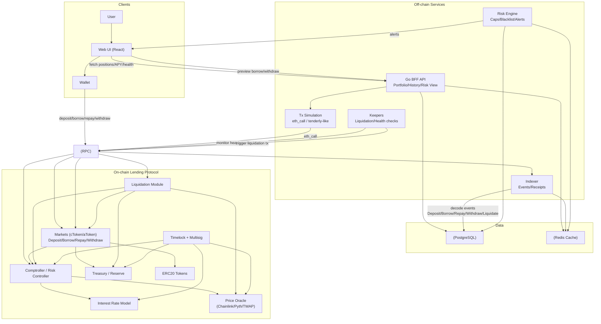
```mermaid
flowchart TB
  %% ========= Clients =========
  subgraph C[Clients]
    U[User]
    FE["Web UI (React)"]
    WAL[Wallet]
  end

  %% ========= Off-chain =========
  subgraph OFF[Off-chain Services]
    API[Go BFF API\nPortfolio/History/Risk View]
    SIM[Tx Simulation\neth_call / tenderly-like]
    IDX[Indexer\nEvents/Receipts]
    KPR[Keepers\nLiquidation/Health checks]
    RISK[Risk Engine\nCaps/Blacklist/Alerts]
  end

  %% ========= Data =========
  subgraph D[Data]
    PG["(PostgreSQL)"]
    REDIS["(Redis Cache)"]
  end

  %% ========= Chain =========
  subgraph CH[On-chain Lending Protocol]
    CTRL[Comptroller / Risk Controller]
    MKT["Markets (cToken/aToken)\nDeposit/Borrow/Repay/Withdraw"]
    IRM[Interest Rate Model]
    LIQ[Liquidation Module]
    TRE[Treasury / Reserve]
    ORA["Price Oracle\n(Chainlink/Pyth/TWAP)"]
    TOK[ERC20 Tokens]
    GOV[Timelock + Multisig]
  end

  %% ========= Flows: Read =========
  U --> FE --> WAL
  FE -->|fetch positions/APY/health| API
  API --> REDIS
  API --> PG

  %% ========= Flows: Preview =========
  FE -->|preview borrow/withdraw| API
  API --> SIM
  SIM -->|eth_call| RPC["(RPC)"]
  RPC --> CTRL
  RPC --> MKT

  %% ========= Flows: Write =========
  WAL -->|deposit/borrow/repay/withdraw| RPC
  RPC --> MKT
  MKT --> CTRL
  CTRL --> ORA
  CTRL --> IRM
  MKT --> TRE
  MKT --> TOK

  %% ========= Liquidation =========
  KPR -->|monitor health factor| RPC
  KPR -->|trigger liquidation tx| RPC
  RPC --> LIQ
  LIQ --> CTRL
  LIQ --> ORA
  LIQ --> MKT
  LIQ --> TRE

  %% ========= Indexing =========
  RPC --> IDX
  IDX -->|decode events\nDeposit/Borrow/Repay/Withdraw/Liquidate| PG
  IDX --> REDIS

  %% ========= Governance =========
  GOV --> CTRL
  GOV --> ORA
  GOV --> IRM
  GOV --> TRE

  %% ========= Risk Ops =========
  RISK --> PG
  RISK --> REDIS
  RISK -->|alerts| FE
```

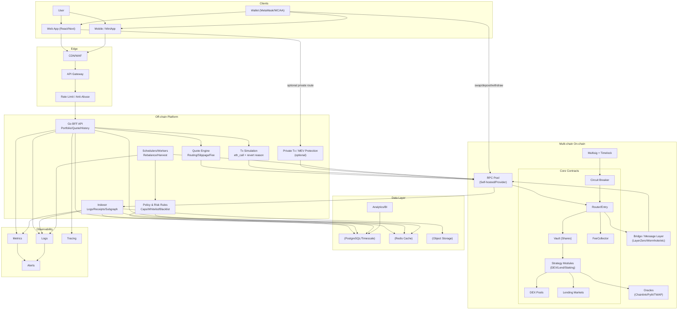
```mermaid
flowchart TB
  %% ============ Clients ============
  subgraph C[Clients]
    U[User]
    WEB["Web App (React/Next)"]
    MOB[Mobile / MiniApp]
    WAL["Wallet (MetaMask/WC/AA)"]
  end

  %% ============ Edge ============
  subgraph E[Edge]
    CDN[CDN/WAF]
    GW[API Gateway]
    RL[Rate Limit / Anti-Abuse]
  end

  %% ============ Off-chain Core ============
  subgraph OFF[Off-chain Platform]
    BFF[Go BFF API\nPortfolio/Quote/History]
    QUOTE[Quote Engine\nRouting/Slippage/Fee]
    SIM[Tx Simulation\neth_call + revert reason]
    MEV["Private Tx / MEV Protection\n(optional)"]
    POLICY[Policy & Risk Rules\nCaps/Whitelist/Blacklist]
    JOB[Schedulers/Workers\nRebalance/Harvest]
    IDX[Indexer\nLogs/Receipts/Subgraph]
  end

  %% ============ Data ============
  subgraph D[Data Layer]
    PG["(PostgreSQL/Timescale)"]
    REDIS["(Redis Cache)"]
    OBJ["(Object Storage)"]
    BI[Analytics/BI]
  end

  %% ============ Chains ============
  subgraph CH[Multi-chain On-chain]
    RPC["RPC Pool\n(Self-hosted/Provider)"]
    BR["Bridge / Message Layer\n(LayerZero/Wormhole/etc)"]
    ORA["Oracles\n(Chainlink/Pyth/TWAP)"]
    GOV[Multisig + Timelock]
    subgraph CORE[Core Contracts]
      ROUTER[Router/Entry]
      VAULT["Vault (Shares)"]
      STRAT["Strategy Modules\n(DEX/Lend/Staking)"]
      AMM[DEX Pools]
      LEND[Lending Markets]
      FEE[FeeCollector]
      PAUSE[Circuit Breaker]
    end
  end

  %% ============ Observability ============
  subgraph OBS[Observability]
    LOG[Logs]
    MET[Metrics]
    TRC[Tracing]
    ALT[Alerts]
  end

  %% ----------- User flow -----------
  U --> WEB --> CDN --> GW
  U --> MOB --> CDN
  WAL --> WEB
  WAL --> MOB

  GW --> RL --> BFF
  BFF --> REDIS
  BFF --> PG

  %% ----------- Quote & Simulate -----------
  BFF --> QUOTE
  QUOTE --> RPC
  BFF --> SIM --> RPC

  %% ----------- Send Tx -----------
  WAL -->|swap/deposit/withdraw| RPC
  WEB -->|optional private route| MEV --> RPC
  RPC --> ROUTER --> VAULT
  VAULT --> STRAT
  STRAT --> AMM
  STRAT --> LEND
  STRAT --> ORA
  ROUTER --> FEE
  GOV --> PAUSE --> ROUTER

  %% ----------- Cross-chain -----------
  ROUTER --> BR
  BR --> RPC

  %% ----------- Indexing & Jobs -----------
  RPC --> IDX
  IDX --> PG
  IDX --> OBJ
  IDX --> REDIS
  JOB --> RPC
  JOB --> POLICY
  POLICY --> PG
  POLICY --> REDIS
  BI --> PG

  %% ----------- Observability -----------
  BFF --> LOG
  BFF --> MET
  BFF --> TRC
  IDX --> LOG
  IDX --> MET
  JOB --> LOG
  MET --> ALT
  LOG --> ALT
```

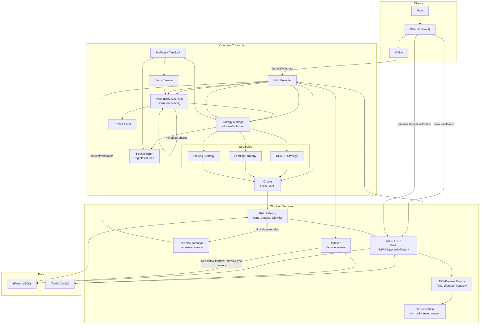
```mermaid
flowchart TB
  %% ========= Clients =========
  subgraph C[Clients]
    U[User]
    FE["Web UI (React)"]
    WAL[Wallet]
  end

  %% ========= Off-chain =========
  subgraph OFF[Off-chain Services]
    API[Go BFF API\nVault list/APY/portfolio/history]
    QUOTE[APY/Preview Engine\nfees, slippage, capacity]
    SIM[Tx Simulation\neth_call + revert reason]
    KPR[Keeper/Automation\nharvest/rebalance]
    IDX[Indexer\ndecode events]
    RISK[Risk & Policy\ncaps, pauses, allowlist]
  end

  %% ========= Data =========
  subgraph D[Data]
    PG["(PostgreSQL)"]
    REDIS["(Redis Cache)"]
  end

  %% ========= On-chain =========
  subgraph CH[On-chain Contracts]
    RPC[RPC Provider]
    VAULT["Vault (ERC4626-like)\nshare accounting"]
    STRAT[Strategy Manager\nallocate/withdraw]
    subgraph STRATS[Strategies]
      SDEX[DEX LP Strategy]
      SLEND[Lending Strategy]
      SSTK[Staking Strategy]
    end
    FEE[FeeCollector\nmgmt/perf fees]
    ORA[Oracle\nprice/TWAP]
    GOV[Multisig + Timelock]
    PAUSE[Circuit Breaker]
    TOK[ERC20 Asset]
  end

  %% ========= User actions =========
  U --> FE --> WAL

  FE -->|view vaults/apy| API
  API --> REDIS
  API --> PG

  FE -->|preview deposit/withdraw| API
  API --> QUOTE --> SIM --> RPC
  RPC --> VAULT
  RPC --> STRAT
  RPC --> ORA

  %% ========= Write transactions =========
  WAL -->|deposit/withdraw| RPC
  RPC --> VAULT
  VAULT --> TOK
  VAULT -->|mint/burn shares| VAULT
  VAULT --> STRAT

  %% ========= Strategy execution =========
  STRAT --> SDEX
  STRAT --> SLEND
  STRAT --> SSTK
  SDEX --> ORA
  SLEND --> ORA
  SSTK --> ORA
  STRAT --> FEE

  %% ========= Automation =========
  KPR -->|harvest/rebalance| RPC
  RPC --> STRAT
  RISK -->|limits/pause rules| KPR

  %% ========= Governance/Safety =========
  GOV --> PAUSE --> VAULT
  GOV --> STRAT
  GOV --> FEE

  %% ========= Indexing =========
  RPC --> IDX
  IDX -->|Deposit/Withdraw/Harvest/Sync events| PG
  IDX --> REDIS

  %% ========= Risk feedback loop =========
  PG --> RISK
  ORA --> RISK
  RISK --> API
```